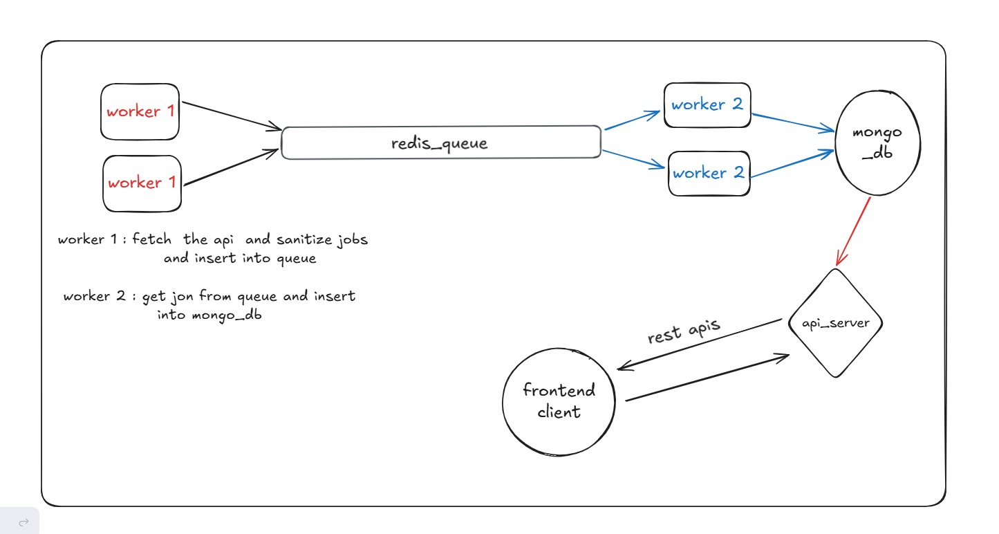

## 🧭 Approach

The project is divided into **three main parts**:

1. **Workers**
2. **Backend Server**
3. **Frontend Client**

---

### ⚙️ Workers

The **worker layer** is responsible for handling data fetching and processing.  
It is further divided into **two separate workers**:

1. **Fetcher Worker**
   - Fetches data from external APIs.  
   - Parses the XML responses.  
   - Pushes the cleaned data into a **Redis queue** for processing.  

2. **Inserter Worker**
   - Pulls data from the Redis queue.  
   - Inserts the processed records into **MongoDB**.  

Both workers are built using **BullMQ** and **Redis** for reliable job queue management.

---

### 🧩 Backend Server

The backend is developed using **Express.js**.  
It provides a set of **RESTful APIs** to interact with the MongoDB database and serve data to the frontend client.

---

### 💻 Frontend Client

The frontend is built with **Next.js**, which consumes the APIs exposed by the backend.  
It provides an intuitive user interface for displaying and managing the data.

### 🧩 Assumptions

For designing the overall approach, the following assumptions were made:

1. **API Consistency in Job Count**  
   - The number of jobs returned by each API is **not consistent**.  
   - A single API call can return multiple jobs, and job bursts are possible.

2. **Unique Job Identifier**  
   - Each job returned by the API includes a **unique job ID**, which ensures deduplication and consistency during data insertion.

3. **System Scalability**  
   - The system is designed to handle up to **100,000 jobs efficiently**, leveraging **BullMQ**, **Redis**, and **MongoDB** for queue management and storage.

4. **Stable API Response Format**  
   - The API response format is assumed to be **consistent over time**, with no structural changes expected.

5. **Future API Expansion**  
   - The architecture is designed to **support additional APIs** in the future without major code modifications.

6. **Data Size Constraints**  
   - The maximum size of cleaned data per API response has been tested to be approximately **1 KB per job record**.

   ## 🏗️ Project Architecture And Implementation

The architecture of the system is designed to ensure scalability, modularity, and reliability across all components — **Workers**, **Backend**, and **Frontend**.  

Below is a high-level architecture diagram representing the overall data flow and component interaction:

### 🔹 Overview

1. **Fetcher Worker** → Fetches and parses data from multiple APIs and pushes it to a Redis queue.  
2. **Inserter Worker** → Pulls cleaned data from the queue and inserts it into MongoDB.  
3. **Backend (Express.js)** → Provides REST APIs for the frontend to retrieve and manage data.  
4. **Frontend (Next.js)** → Consumes backend APIs to display and interact with job listings in the UI.  
5. **MongoDB** → Stores structured job data.  
6. **Redis + BullMQ** → Handles asynchronous job queuing and reliable background processing.

---

